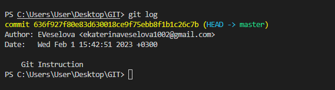

# Git Instruction 

## **Основные команды в Git**

1. git init - команда для создания репозитория в текущей папке

2. git add - Добавление файлов
    
    * *git add . - добавление всех файлов в текущем каталоге*
    * *git add readme.md - добавление файла с именем "readme.md"*

3. git commit -m 'Name of commit' - создание сохранения в Гите

4. git status - показывает текущее состояние гита, есть ли изменения, которые нужно закоммитить 

5. git checkout - переключение между разными коммитами

     * *git checkout master - чтобы вернуться в тот коммит, где мы работаем*

     * *git checkout branch_name - чтобы перейти на ветку с именем branch_name

6. git config --global user.email 'you@example.com' - сообщаем гиту свою почту, чтобы гиту был понятен пользователь

7. git config --global user.name 'Your Name' -
сообщаем гиту имя пользователя

8. git log - показывает журнал изменений

   * Как выглядит команда:

* чтобы вывести список коммитов в виде дерева необходимо использовать команду **git log --graph**

9. git diff - показывает разницу между текущим файлом и сохраненным

10. git branch - посмотреть в какой ветке мы находимся

[Ссылка для скачивания Git](https://git-scm.com/)

## Создание веток в Git

* чтобы вывести список веток необходимо набрать команду **git branch**

* чтобы создать новую ветку с именем **branch_name** используем комнду  **git branch branch_name**

* чтобы перейти на ветку с именем **branch_name** используем команду **git checkout branch_name**

* чтобы удалить ветку необходимо использовать команду **git branch -d branch_to_delete**(имя ветки, которую хотим удалить)

